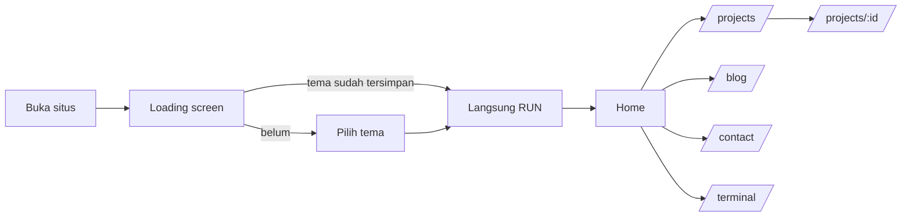

# dwickport

Portofolio web pribadi bergaya Google Design (palet biru, hijau, kuning, merah, mode terang/gelap, kartu berbingkai gradien) dengan terminal CLI interaktif dan guestbook real-time berbasis Firebase.

## Daftar isi
- [Introduction](#introduction)
- [Workflow](#workflow)
- [Cara menjalankan](#cara-menjalankan)
- [Struktur folder](#struktur-folder)
- [Konfigurasi & keamanan](#konfigurasi--keamanan)
- [Deploy](#deploy)

---

## Introduction

### Tujuan
Menampilkan profil, skill, skripsi, sertifikasi, dan proyek secara informatif bagi rekruter dan klien, sekaligus interaktif bagi sesama developer.

### Fitur utama
| Fitur | Keterangan |
|---|---|
| Google-style UI | Palet warna Google, dark/light mode (tersimpan di `localStorage`), latar grid animasi (`ShapeGrid`) |
| Loading screen | Pilih tema, jalankan "instalasi" bergaya terminal, efek `MagicRings` (WebGL, dimuat lazy) |
| Home | Hero, About, Growth Hub (Skills, Academic, Journey), Featured Projects, Contact |
| Arsip proyek | `/projects` dengan pencarian, filter kategori, paginasi 6 item; `/projects/:id` berisi studi kasus |
| Blog & Gallery | `/blog` dengan tab artikel dan galeri, paginasi, lightbox |
| CLI `wick` | Terminal di `/terminal` dan widget melayang: navigasi, ganti tema, pencarian data, buka CV, riwayat ↑/↓, autocomplete Tab |
| Guest Chat | Guestbook real-time (Firebase Firestore) di `/contact` dan widget chat di Home |
| Aksesibilitas | Menghormati `prefers-reduced-motion`, label ARIA pada kontrol utama |

### Tech stack
React 19, Vite 8, Tailwind CSS 4, React Router 7, Framer Motion, Three.js (loading screen), Lucide React, Firebase (Firestore).

---

## Workflow

### 1. Alur pengunjung


### 2. Alur data
- **Konten statis** (profil, skill, timeline, skripsi, sertifikat, proyek, artikel) hanya ada di `src/data/portfoliodata.js`. Komponen UI dan perintah CLI (`wick about`, `skills`, `projects`, `search`) membaca dari file ini, jadi ubah di satu tempat saja.
- **Guestbook** dikelola hook `src/hooks/useGuestbook.js`:
  1. `onSnapshot` Firestore mengalirkan 50 pesan terbaru secara real-time.
  2. `addMessage()` memvalidasi (trim, batas panjang, jeda 30 detik) lalu menulis dokumen ke koleksi `guestbook`.
  3. `react()` menambah reaksi dengan `increment(1)`, satu kali per jenis per pesan per browser.
  4. Firestore Rules (`firestore.rules`) memvalidasi ulang di sisi server.
- **Tema**: `Navbar` dan `LoadingScreen` membaca/menulis `localStorage('theme')`; `App.jsx` mengamati class `dark` pada `<html>` untuk mengubah warna grid.

### 3. Alur pengembangan
1. Buat branch: `git checkout -b feat/nama-fitur`
2. Kerjakan perubahan, jalankan `npm run dev`
3. Sebelum commit: `npm run lint && npm run build`
4. Commit dengan pesan jelas, push, lalu buka Pull Request atau merge ke `main`
5. Hosting (Vercel/Netlify) otomatis membangun ulang dari `main`

---

## Cara menjalankan

### Prasyarat
- Node.js `^20.19` atau `>=22.12` (syarat Vite 8)
- npm
- Proyek Firebase dengan Firestore aktif (hanya untuk Guest Chat)

> deym

### Langkah
```bash
# 1. Clone dan install
git clone https://github.com/<username>/<repo>.git
cd <repo>
npm install

# 2. Siapkan environment
cp .env.example .env.local
# isi nilai VITE_FIREBASE_* dari Firebase Console

# 3. Jalankan mode pengembangan
npm run dev            # http://localhost:5173
```

### Script
| Perintah | Fungsi |
|---|---|
| `npm run dev` | Dev server dengan HMR |
| `npm run build` | Build produksi ke `dist/` |
| `npm run preview` | Menjalankan hasil build secara lokal |
| `npm run lint` | Pemeriksaan ESLint |

### Setup Firebase singkat
1. Firebase Console, buat project, lalu **Firestore Database** (mode production, region `asia-southeast2`).
2. **Project settings, Your apps, Web** untuk mendapatkan config, lalu isi `.env.local`.
3. Tab **Firestore, Rules**, tempel isi `firestore.rules`, lalu **Publish**.
4. Restart `npm run dev` setiap mengubah `.env.local`.

Tanpa konfigurasi Firebase, situs tetap berjalan; hanya Guest Chat yang menampilkan pesan "belum dikonfigurasi".

### Perintah CLI
Semua perintah wajib diawali `wick`:

```
wick help                       daftar perintah
wick about | skills | projects  info dari portfoliodata
wick search <kata>              cari proyek, skill, sertifikat, skripsi
wick mode light|dark            ganti tema
wick nav to <halaman>           home | projects | blog | contact | terminal
wick cv                         buka CV
wick contact                    info kontak
wick clear                      bersihkan layar
```

---

## Struktur folder

```
dwekfolio/
├── public/
│   ├── favicon.svg                 # favicon (empat titik warna Google)
│   ├── icons.svg                   # sprite ikon sosial bawaan template
│   └── cv-dwiki-kurniawan.pdf      # CV yang dibuka tombol/CLI
│
├── src/
│   ├── assets/
│   │   └── profile.jpg             # foto profil (About)
│   │
│   ├── components/
│   │   ├── growth/                 # sub-tab Growth Hub
│   │   │   ├── SkillsTab.jsx       # kartu skill + progress bar
│   │   │   ├── AcademicTab.jsx     # skripsi + sertifikasi + "currently learning"
│   │   │   └── JourneyTab.jsx      # timeline zig-zag
│   │   │
│   │   ├── reactbits/              # efek animasi (basis ReactBits)
│   │   │   ├── CursorGrid.jsx      # grid reaktif kursor (Hero)
│   │   │   ├── DecryptText.jsx     # efek teks terdekripsi
│   │   │   ├── GooeyNav.jsx/.css   # navigasi gooey (desktop)
│   │   │   ├── MagicRings.jsx/.css # cincin WebGL (loading screen)
│   │   │   └── ShapeGrid.jsx/.css  # latar grid canvas
│   │   │
│   │   ├── About.jsx               # bagian "Tentang Saya"
│   │   ├── Avatar.jsx              # ikon avatar guestbook
│   │   ├── BaseTerminal.jsx        # inti CLI (dipakai halaman & widget)
│   │   ├── FloatingTerminal.jsx    # widget CLI melayang
│   │   ├── Growth.jsx              # kontainer tab Growth Hub
│   │   ├── LiveComment.jsx         # widget Guest Chat melayang (Home)
│   │   ├── LoadingScreen.jsx       # layar pembuka + pilih tema
│   │   ├── ProjectCard.jsx         # kartu proyek bersama
│   │   ├── contactsection.jsx      # CTA kontak di Home
│   │   ├── hero.jsx                # hero + headline interaktif
│   │   ├── navbar.jsx              # navbar, toggle tema, menu mobile
│   │   └── projectssection.jsx     # 3 proyek unggulan + modal
│   │
│   ├── data/
│   │   ├── avatars.js              # daftar pilihan avatar
│   │   └── portfoliodata.js        # SUMBER TUNGGAL konten portofolio
│   │
│   ├── hooks/
│   │   └── useGuestbook.js         # logika guestbook (Firestore)
│   │
│   ├── lib/
│   │   └── firebase.js             # inisialisasi Firebase dari env
│   │
│   ├── pages/
│   │   ├── Home.jsx                # /
│   │   ├── Projects.jsx            # /projects
│   │   ├── ProjectDetail.jsx       # /projects/:id
│   │   ├── Blog.jsx                # /blog
│   │   ├── Contact.jsx             # /contact
│   │   └── TerminalShell.jsx       # /terminal
│   │
│   ├── App.jsx                     # layout, router, latar, footer
│   ├── main.jsx                    # entry point (MotionConfig)
│   └── index.css                   # Tailwind, varian dark, marquee, reduced-motion
│
├── .env.example                    # contoh variabel (BOLEH di-commit)
├── .gitignore
├── eslint.config.js
├── firestore.rules                 # aturan keamanan Firestore
├── index.html                      # entry HTML + meta SEO
├── package.json
├── vite.config.js
└── README.md
```

---

## Konfigurasi & keamanan

- `.env.local` **tidak boleh** di-commit. Hanya `.env.example` yang ikut repo.
- Config web Firebase tidak rahasia (terlihat di browser). Keamanan data ada di `firestore.rules`; pastikan sudah dipublikasikan.
- Disarankan mengaktifkan **Firebase App Check (reCAPTCHA v3)** untuk menyaring bot.
- Isi data asli di `src/data/portfoliodata.js`: `socials`, `liveUrl`/`githubUrl` proyek, dan `url` sertifikat. Tombol dengan URL kosong otomatis disembunyikan.

## Deploy

Situs ini memakai `BrowserRouter`, jadi hosting harus mengarahkan semua rute ke `index.html`.

- **Vercel**: tambahkan `vercel.json`
  ```json
  { "rewrites": [{ "source": "/(.*)", "destination": "/index.html" }] }
  ```
- **Netlify**: buat `public/_redirects` berisi `/*  /index.html  200`

Lalu masukkan variabel `VITE_FIREBASE_*` di pengaturan Environment Variables hosting.
