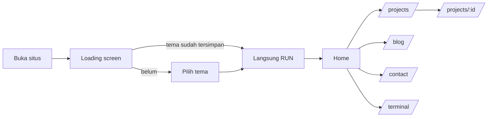

# Dwiki Porfolio

Portofolio web pribadi bergaya Google Design (palet biru, hijau, kuning, merah, mode terang/gelap, kartu berbingkai gradien) dengan terminal CLI interaktif dan guestbook real-time berbasis Firebase.

## Daftar isi
- [Introduction](#introduction)
- [Workflow](#workflow)
- [Cara menjalankan](#cara-menjalankan)
- [Struktur folder](#struktur-folder)
- [Konfigurasi & keamanan](#konfigurasi--keamanan)
- [Deploy](#deploy)

---

## Introduction

### Tujuan
Menampilkan profil, skill, skripsi, sertifikasi, dan proyek secara informatif bagi rekruter dan klien, sekaligus interaktif bagi sesama developer.

### Fitur utama
| Fitur | Keterangan |
|---|---|
| Google-style UI | Palet warna Google, dark/light mode (tersimpan di `localStorage`), latar grid animasi (`ShapeGrid`) |
| Loading screen | Pilih tema, jalankan "instalasi" bergaya terminal, efek `MagicRings` (WebGL, dimuat lazy) |
| Home | Hero, About, Growth Hub (Skills, Academic, Journey), Featured Projects, Contact |
| Arsip proyek | `/projects` dengan pencarian, filter kategori, paginasi 6 item; `/projects/:id` berisi studi kasus |
| Blog & Gallery | `/blog` dengan tab artikel dan galeri, paginasi, lightbox |
| CLI `wick` | Terminal di `/terminal` dan widget melayang: navigasi, ganti tema, pencarian data, buka CV, riwayat ↑/↓, autocomplete Tab |
| Guest Chat | Guestbook real-time (Firebase Firestore) di `/contact` dan widget chat di Home |
| Aksesibilitas | Menghormati `prefers-reduced-motion`, label ARIA pada kontrol utama |

### Tech stack
React 19, Vite 8, Tailwind CSS 4, React Router 7, Framer Motion, Three.js (loading screen), Lucide React, Firebase (Firestore).

---

## Workflow

### 1. Alur pengunjung


### 2. Alur data
- **Konten statis** (profil, skill, timeline, skripsi, sertifikat, proyek, artikel) hanya ada di `src/data/portfoliodata.js`. Komponen UI dan perintah CLI (`wick about`, `skills`, `projects`, `search`) membaca dari file ini, jadi ubah di satu tempat saja.
- **Guestbook** dikelola hook `src/hooks/useGuestbook.js`:
  1. `onSnapshot` Firestore mengalirkan 50 pesan terbaru secara real-time.
  2. `addMessage()` memvalidasi (trim, batas panjang, jeda 30 detik) lalu menulis dokumen ke koleksi `guestbook`.
  3. `react()` menambah reaksi dengan `increment(1)`, satu kali per jenis per pesan per browser.
  4. Firestore Rules (`src/lib/firestore.rules`) memvalidasi ulang di sisi server.
- **Tema**: `Navbar` dan `LoadingScreen` membaca/menulis `localStorage('theme')`; `App.jsx` mengamati class `dark` pada `<html>` untuk mengubah warna grid.

### 3. Alur pengembangan
1. Buat branch: `git checkout -b feat/nama-fitur`
2. Kerjakan perubahan, jalankan `npm run dev`
3. Sebelum commit: `npm run lint && npm run build`
4. Commit dengan pesan jelas, push, lalu buka Pull Request atau merge ke `main`
5. Hosting (Vercel/Netlify) otomatis membangun ulang dari `main`

---

## Cara menjalankan

### Prasyarat
- Node.js `^20.19` atau `>=22.12` (syarat Vite 8)
- npm
- Proyek Firebase dengan Firestore aktif (hanya untuk Guest Chat)

> deym

### Langkah
```bash
# 1. Clone dan install
git clone https://github.com/<username>/<repo>.git
cd <repo>
npm install

# 2. Siapkan environment
cp .env.example .env.local
# isi nilai VITE_FIREBASE_* dari Firebase Console


# 3. Jalankan mode pengembangan
npm run dev            # http://localhost:5173
```

### Script
| Perintah | Fungsi |
|---|---|
| `npm run dev` | Dev server dengan HMR |
| `npm run build` | Build produksi ke `dist/` |
| `npm run preview` | Menjalankan hasil build secara lokal |
| `npm run lint` | Pemeriksaan ESLint |

### Setup Firebase singkat
1. Firebase Console, buat project, lalu **Firestore Database** (mode production, region `asia-southeast2`).
2. **Project settings, Your apps, Web** untuk mendapatkan config, lalu isi `.env.local`.
3. Tab **Firestore, Rules**, tempel isi `src/lib/firestore.rules`, lalu **Publish**.
4. Restart `npm run dev` setiap mengubah `.env.local`.

Tanpa konfigurasi Firebase, situs tetap berjalan; hanya Guest Chat yang menampilkan pesan "belum dikonfigurasi".

### Perintah CLI (`wick`)

Terminal di dalam situs bukan hiasan: `src/terminal/` berisi search engine
miniature dan shell lengkap yang membaca seluruh data proyek. Semua perintah
diawali `wick`, punya alias, `man`/`help <perintah>`, dan bisa dipipokan.

**Pencarian**

```
wick find <kata>                  cari di seluruh data proyek
wick find react --type=project     batasi jenis data
wick find "mode gelap" --limit=3   batasi jumlah hasil
wick find react --json             output JSON
wick suggest rea                   saran kata kunci (juga dipakai Tab)
wick where                         daftar jenis data yang bisa dicari
```

Mesin pencari memakai inverted index, pembobotan field
(judul > tag > subjudul > isi), skor akin BM25, dan tiga tingkat kecocokan:
persis, prefix, dan fuzzy (toleransi typo 1-2 huruf). Semua token harus cocok
(AND); pakai `or:` untuk melonggarkan. Contoh: `wick find gamificai` tetap
menemukan artikel gamifikasi.

**Data**

```
wick about | whoami | stats        profil, ringkasan, statistik korpus
wick skills [--verbose]            skill per kategori + level
wick projects [--verbose]          daftar proyek
wick project <id>                  detail satu proyek
wick articles [--tag=...]          daftar artikel
wick read <id>                     isi penuh artikel
wick tags                          frekuensi tag
wick thesis | journey | certifications | learning
wick contact [--open]              email + sosial
wick cv [--path]                   buka/lihat lokasi CV
wick source [--grep=...]           jelajahi modul source
wick guestbook [--status]          data guestbook real-time
```

**Navigasi & sistem**

```
wick nav to <home|projects|blog|contact|terminal>
wick nav to <project-id>           buka halaman detail proyek
wick pages                         daftar route aplikasi
wick theme light|dark|toggle
wick env                           status environment (nilai ter-mask)
wick tree                          struktur proyek
wick history | clear | version | date
```

**Pipeline & filter**

```
wick projects | wick grep android
wick articles | wick head -n=3
wick projects | wick wc
wick articles | wick sort -r
wick echo "halo" | wick wc
```

**Keybind:** `Tab`ocomplete, `↑`/`↓` riwayat, `Ctrl+L` clear, `Esc` batal.

Menambah perintah cukup satu entri di `src/terminal/commands.js`. Menambah
data yang bisa dicari cukup menambahnya di `src/terminal/corpus.js` — index
dibangun ulang otomatis dari sumber data.

### Keamanan environment

- Nilai asli hanya ada di `.env.local` (di-ignore git). Yang di-commit hanya
  `.env.example` yang isinya kosong.
- Semua pembacaan env lewat `src/config/env.js`. Nilai yang keluar ke UI
  selalu ter-mask; `wick env` hanya menampilkan status dan 4 karakter akhir.
- Prefix `VITE_` membuat nilai terbaca di browser, jadi jangan pernah mengisi
  private key atau admin SDK di sana. Proteksi data ada di Firestore Rules.

---

## Struktur folder

```
dwekfolio/
├── public/
│   ├── favicon.svg                 # favicon tab browser (SVG, dipakai lewat <link rel="icon">)
│   ├── apple-touch-icon.png        # favicon untuk iOS/Safari (butuh PNG, bukan SVG)
│   ├── icons.svg                   # sprite ikon sosial bawaan template
│   ├── _redirects                  # rewrite SPA untuk Netlify
│   └── Resume_dwikikurniawan.pdf    # CV asli yang dibuka tombol/CLI
│
├── src/
│   ├── assets/
│   │   └── profile.jpg             # foto profil (About)
│   │
│   ├── components/
│   │   ├── growth/                 # sub-tab Growth Hub
│   │   │   ├── SkillsTab.jsx       # kartu skill + progress bar
│   │   │   ├── AcademicTab.jsx     # skripsi + sertifikasi + "currently learning"
│   │   │   └── JourneyTab.jsx      # timeline zig-zag
│   │   │
│   │   ├── reactbits/              # efek animasi (basis ReactBits)
│   │   │   ├── CursorGrid.jsx      # grid reaktif kursor (Hero)
│   │   │   ├── DecryptText.jsx     # efek teks terdekripsi
│   │   │   ├── GooeyNav.jsx/.css   # navigasi gooey (desktop)
│   │   │   ├── MagicRings.jsx/.css # cincin WebGL (loading screen)
│   │   │   └── ShapeGrid.jsx/.css  # latar grid canvas
│   │   │
│   │   ├── About.jsx               # bagian "Tentang Saya"
│   │   ├── Avatar.jsx              # ikon avatar guestbook
│   │   ├── BaseTerminal.jsx        # komponen terminal (UI, history, Tab, copy)
│   │   ├── FloatingTerminal.jsx    # widget CLI melayang
│   │   ├── Growth.jsx              # kontainer tab Growth Hub
│   │   ├── LiveComment.jsx         # widget Guest Chat melayang (Home)
│   │   ├── LoadingScreen.jsx       # layar pembuka + pilih tema
│   │   ├── ProjectCard.jsx         # kartu proyek bersama
│   │   ├── contactsection.jsx      # CTA kontak di Home
│   │   ├── hero.jsx                # hero + headline interaktif
│   │   ├── navbar.jsx              # navbar, toggle tema, menu mobile
│   │   └── projectssection.jsx     # 3 proyek unggulan + modal
│   │
│   ├── terminal/                   #-mesin CLI + search engine
│   │   ├── engine.js               # parser: prefix, flag, pipeline, helper hasil
│   │   ├── search.js               # tokenizer, inverted index, skor BM25, fuzzy
│   │   ├── corpus.js               # dokumen yang bisa dicari (dari semua sumber data)
│   │   ├── commands.js             # registry perintah (39 perintah + alias)
│   │   └── run.js                  # executor: pipeline, error handling, export
│   │
│   ├── config/
│   │   └── env.js                  # pembacaan env + masking nilai sensitif
│   │
│   ├── data/
│   │   ├── articles.js             # artikel tulisan sendiri (isi penuh)
│   │   ├── avatars.js              # daftar pilihan avatar
│   │   ├── guestbook.js            # konstanta guestbook (dipakai UI, hook, CLI)
│   │   └── portfoliodata.js        # SUMBER TUNGGAL konten portofolio
│   │
│   ├── hooks/
│   │   ├── useGuestbook.js         # logika guestbook (Firestore)
│   │   └── useLiveArticles.js      # feed dev.to real-time + cache
│   │
│   ├── lib/
│   │   ├── firebase.js             # inisialisasi Firebase dari env
│   │   └── firestore.rules         # aturan keamanan Firestore
│   │
│   ├── pages/
│   │   ├── Home.jsx                # /
│   │   ├── Projects.jsx            # /projects
│   │   ├── ProjectDetail.jsx       # /projects/:id
│   │   ├── Blog.jsx                # /blog
│   │   ├── Contact.jsx             # /contact
│   │   └── TerminalShell.jsx       # /terminal
│   │
│   ├── App.jsx                     # layout, router, latar, footer
│   ├── main.jsx                    # entry point (MotionConfig)
│   └── index.css                   # Tailwind, varian dark, marquee, reduced-motion
│
├── .env.example                    # contoh variabel (BOLEH di-commit)
├── .gitignore
├── eslint.config.js
├── index.html                      # entry HTML + meta SEO
├── package.json
├── vercel.json                     # rewrite SPA untuk Vercel
├── vite.config.js
└── README.md
```

---

## Konfigurasi & keamanan

- `.env.local` **tidak boleh** di-commit (di-ignore oleh `.env.*` dan `*.local`). Hanya `.env.example` yang ikut repo, dan isinya kosong.
- Semua nilai env dibaca lewat `src/config/env.js`. Apa pun yang tampil di UI atau terminal (termasuk `wick env`) selalu ter-mask — tidak ada nilai mentah yang dicetak ke konsol.
- Config web Firebase tidak rahasia (terlihat di browser). Keamanan data ada di `src/lib/firestore.rules`; pastikan sudah dipublikasikan.
- Disarankan mengaktifkan **Firebase App Check (reCAPTCHA v3)** untuk menyaring bot.
- `public/Resume_dwikikurniawan.pdf` adalah CV asli (sumbernya juga ada di root repo). Tombol CV di About, Contact, dan CLI `wick cv` semuanya menunjuk ke file itu.
- Isi data asli di `src/data/portfoliodata.js`: `socials`, `liveUrl`/`githubUrl` proyek, dan `url` sertifikat. `githubUrl` sudah terisi; `liveUrl` masih kosong karena belum ada URL demo yang aktif. Tombol dengan URL kosong otomatis disembunyikan.
- `src/data/guestbook.js` adalah sumber tunggal konstanta guestbook, tapi nilainya **harus disalin manual** ke `src/lib/firestore.rules` karena Rules berjalan di bahasa terpisah. Ubah satu, ubah yang lain.

## Deploy

Situs ini memakai `BrowserRouter`, jadi hosting harus mengarahkan semua rute ke `index.html`. Repo sudah menyertakan keduanya:

- **Vercel**: tambahkan `vercel.json`
  ```json
  { "rewrites": [{ "source": "/(.*)", "destination": "/index.html" }] }
  ```
- **Netlify**: buat `public/_redirects` berisi `/*  /index.html  200`

Lalu masukkan variabel `VITE_FIREBASE_*` di pengaturan Environment Variables hosting.
